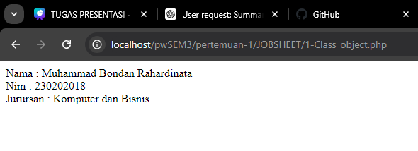
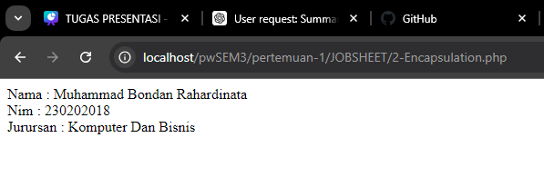
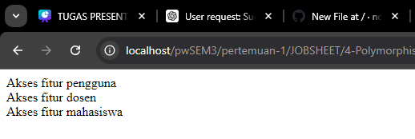
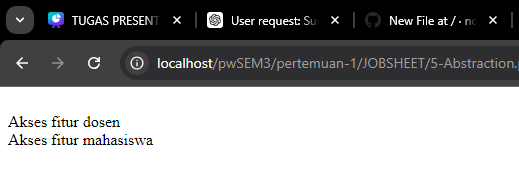

# DOKUMENTASI OOP
Object-Oriented Programming (OOP) adalah paradigma pemrograman yang
berfokus pada konsep objek. Dalam OOP, konsep dasar seperti class dan object digunakan untuk memodelkan masalah dunia nyata ke dalam kode program.
## 1. Class and Object

```php
<?php
// definisi class mahasiswa
class Mahasiswa {
    // attribut atau properti
    public $nama;
    public $nim;
    public $jurusan;
    // metode atau function
    public function tampilkanData() {
        return "Nama : $this->nama <br>Nim : $this->nim <br>Jurursan : $this->jurusan";
    }

    // constructor
    public function __construct($nama, $nim, $jurusan) {
        $this->nama = $nama;
        $this->nim = $nim;
        $this->jurusan = $jurusan;
    }
}

// instansi objek
$mahasiswa = new Mahasiswa ("Muhammad Bondan Rahardinata", "230202018", "Komputer dan Bisnis");
echo $mahasiswa->tampilkanData();
?>
```

## 2-Encapstion
```php
<?php
// definisi class mahasiswa
class Mahasiswa {
    // attribute atau properti yang bersifat akses private
    private $nama;
    private $nim;
    private $jurusan;

    // metode atau function menalpilkan data mahasiswa 
    public function tampilkanData() {
        return "Nama : $this->nama <br>Nim : $this->nim <br>Jurursan : $this->jurusan";
    }
    // constructor
    public function __construct($nama, $nim, $jurusan) {
        $this->nama = $nama;
        $this->nim = $nim;
        $this->jurusan = $jurusan;
    }
    // getter untuk mendapatkan properti nama
    public function getNama() {
        return $this->nama;
    }
    // getter untuk mendapatkan properti nim
    public function getNim() {
        return $this->nim;
    }
    // getter untuk mendapatkan properti jurusan
    public function getJurursan() {
        return $this->jurusan;
    }
    // setter mengatur nilai properti nama
    public function setNama() {
        $this->nama = $nama;
    }
    // setter mengatur nilai properti nim
    public function setNim() {
        $this->nim = $nim;
    }
    // setter mengatur nilai properti jurusan
    public function setJurusan() {
        $this->jurusan = $jurusan;
    }
}

// instansi objek
$mahasiswa = new Mahasiswa ("Muhammad Bondan Rahardinata", "230202018", "Komputer Dan Bisnis");
echo $mahasiswa->tampilkanData(); // output
?>
```

## 3. Inheritance
```php
<?php
// definisi class pengguna 
class Pengguna {
    // attribute atau properti yang bersifat akses protected atau membatasi akses 
    protected $nama;

    // construct
    public function __construct($nama) {
        $this->nama = $nama;
    }

    // getter untuk mendapatkan properti nama
    public function getNama() {
        return $this->nama;
    }
}

// class dosen yang mewarisi dari class pengguna
class Dosen extends Pengguna {
    // attribute atau properti yang bersifat akses private 
    private $matakuliah;

    //public construct
    public function __construct($nama, $matakuliah) {
        parent::__construct($nama);
        $this->matakuliah = $matakuliah;
    }

    // getter untuk mendapatkan nilai matakuliah
    public function getMatakuliah() {
        return $this->matakuliah;
    }
}

// instansi objek
$dosen = new Dosen ("Pak Abda'u", "<br>Praktikum WEB 2");
echo $dosen->getNama(); // output
echo $dosen->getMatakuliah(); // output
?>
```


## 4. Polymorphhism
```php
<?php
// definisi class pengguna 
class Pengguna {
    // construct
    public function __construct() {

    }
    // metode atau fungsi
    public function aksesFitur() {

        return "Akses fitur pengguna";
    }
}

// class dosen yang mewarisi dari class pengguna
class Dosen extends Pengguna {
    // construct
    public function __consturct() {

    }
    // metode atau function
    public function aksesFitur() {
        return "<br>Akses fitur dosen";
    }
}

// class mahasiswa yang mewarisi dari class pengguna 
class Mahasiswa extends Pengguna {
    public function __construct() {

    }

    // metode atau function
    public function aksesFitur() {
        return "<br>Akses fitur mahasiswa";
    }
}

// instansi objek
$aksesPengguna = new Pengguna(); 
$aksesDosen = new Dosen(); 
$aksesMhs = new Mahasiswa();
// output
echo $aksesPengguna->aksesFitur();
echo $aksesDosen->aksesFitur();
echo $aksesMhs->aksesFitur();
?>
```


## 5. Abstraction
```php
<?php
// definisi abstrak class pengguna
abstract class Pengguna {
    // construct
    public function __construct() {

    }

    abstract public function aksesFitur();
}

// class doesen yang mewarisi dari class pengguna
class Dosen extends Pengguna {
    public function __consturct() {

    }

    // implementasi metode abstrak aksesFitur dari class pengguna
    public function aksesFitur() {
        return "<br>Akses fitur dosen";
    }
}

// class mahasisiwa yang mewarisi dari class pengguna
class Mahasiswa extends Pengguna {
    // construct 
    public function __construct() {

    }
    // implementasi metode abstrak aksesFitur dari class pengguna
    public function aksesFitur() {
        return "<br>Akses fitur mahasiswa";
    }
}

// instansi objek 
$aksesDosen = new Dosen(); 
$aksesMhs = new Mahasiswa();
// output
echo $aksesDosen->aksesFitur();
echo $aksesMhs->aksesFitur();
?>
```

